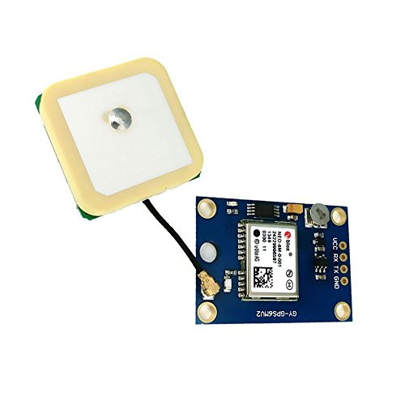

# ESP32-SIM800
GPS tracking, send data over MQTT  with the TTGO T-Call SIM800

**Framework used: Arduino**

**IDE used**:
[PlatformIO Core](https://docs.platformio.org/en/latest/quickstart.html)

**TTGO T-Call SIM800 library**
[Forked from vshymanskyy/TinyGSM](https://github.com/vshymanskyy/TinyGSM)
https://github.com/RoyTrenneman/TinyGSM

**GPS module**

